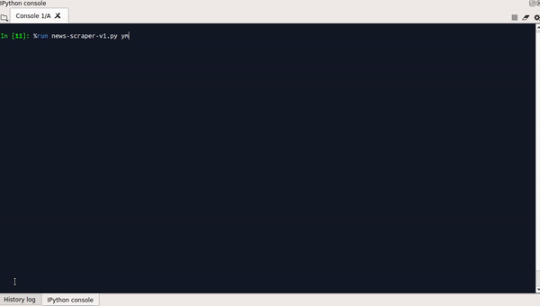

# News-scraper

<p align="center"></p>

## Overview
News-scraper is a simple script for scraping the most 3 visited  news websites in Egypt  (youm7.com, almasryalyoum.com, shorouknews.com) to get tech ,sport, political news titles and the summary if available. 
it displays the news based on the arguments  passed to it. The script depends on scraping the website not RSS feed.

## Prepare environment
To software dependencies needed to run the script are:
- **python 3.6+** : If the enviroment is linux then python will be pre installed we just need to make sure that the version is 3.6+.
If the enviroment is windows then we need to download and install python if it is not installed. We can download python from this [link](https://www.python.org/downloads/).
- To install the required libraryes for the script we need to issue this command ```pip install -r requirements.txt```
- To properly show arabic text using wordcloud we need to do extra step by replacing the font file (DroidSansMono.ttf) in the wordcloud library by this [file]( https://github.com/maidaly/Web-Scraping/blob/master/news-scraping/DroidSansMono.ttf)

## Usage
- We can run the script by using the command ******python news-scraper.py news-site news-type****** the news-site and news-type are
the main arguments to run the script.
- There are two optional arguments we can pass if we need them. They are -wc to show the wordcloud of the news and -sv to save the news as 
csv file format. So if we need to use this arguments the command will be ******python news-scraper.py news-site news-type -wc yes -sv yes******
#### Examples:
- To get the sport news from youm7.com. we use the command:
```python news-scraper.py ym7 s``` or ```python news-scraper.py yom s``` . The other accepted arguments for youm7 website ("ym","yom","ym7","y7","youm7","youm","y").

- To get the political news from almasryalyoum.com and show wordcloud we use the command:
```python news-scraper.py msr p -wc yes```

- To get the tech news from shorouknews.com and show wordcloud and save the result.we use the command:```python news-scraper.py sh t -wc yes -sv yes```.
This command will generate csv file with name " news_year-month-day-hour-minute " year-month-day-hour-minute will be replaced by the corresponding
time parameters of running script. 

- To get the sport news from the 3 websites.we use the command:```python news-scraper.py all s```
